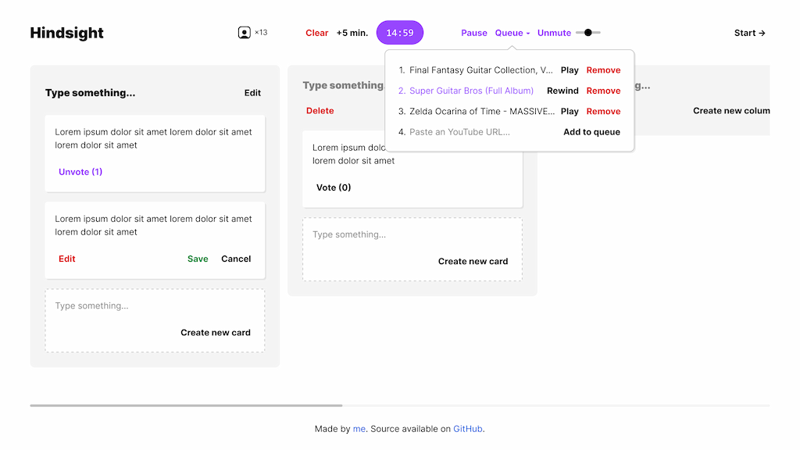

# Hindsight



> <https://hindsight.crz.li>

**Hindsight** is a real-time retrospective board for small teams.

- 👉 Free, open-source and hosted on the edge.
- 🖼️ Clean and focused design. You can check it out on [Figma](https://www.figma.com/file/6SbO2KH3lDlHjgg8RZcwPA/Hindsight?node-id=1%3A144&t=Np6HYeUHQLPBjCTE-4)).
- 🔒 No back-end. Data is encrypted and shared directly between connected browsers using WebRTC.
- 🍀 No sign-up. Invite others by sharing the URL.

## Development

This web application is built using [Parcel](https://parceljs.org). Node.js v20+ is recommended.

To install the dependencies:

```sh
npm ci
```

To start the development server.

```sh
npm start
```

Before commiting you should run the `check` script to lint, type check and format the code:

```sh
npm run check
```

## Legal

Apache-2.0 © 2022 Arthur Corenzan.
