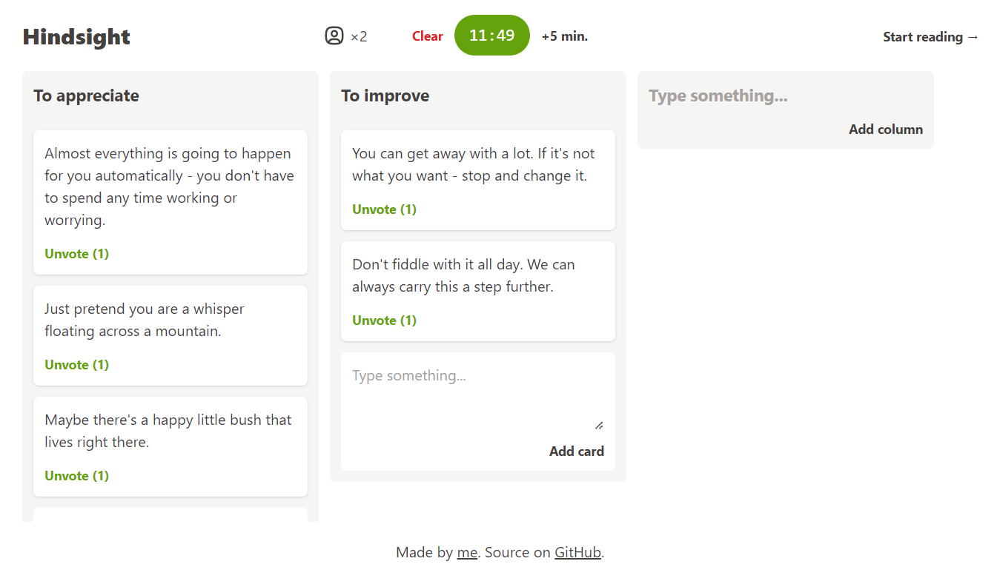

# Hindsight



**Hindsight** is a real-time retrospective board for evergreen teams.

- 👉 Free, open-source, no sign-up required.
- 🔒 Locally stored, no ads, no telemetry.

## Development

This web application is built using [Vite](https://vite.dev). Node.js v24+ is recommended.

To install the dependencies:

```sh
npm ci
```

To start the development server.

```sh
npm start
```

Before commiting you should run type check, lint and auto formatter:

```sh
npm run fix
```

## Legal

Apache-2.0 © 2022 Arthur Corenzan.
